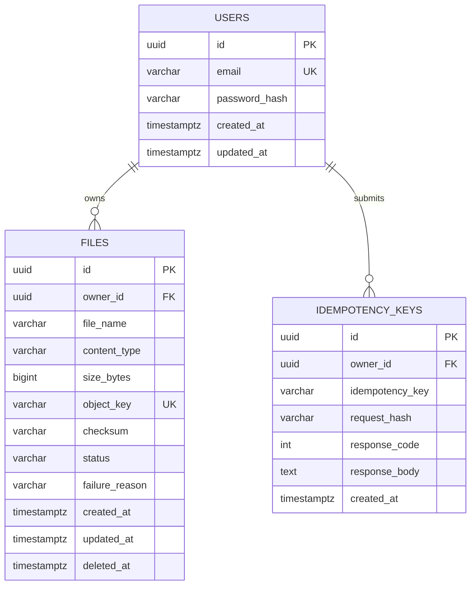

# ERD (Milestone A)

## Notes

1. `files.owner_id` scopes every file to a single user.
2. `files.object_key` is unique and maps metadata to object storage.
3. `idempotency_keys` is scoped by `(owner_id, idempotency_key)`.
4. `deleted_at` enables soft deletes and safe recovery/audit.
