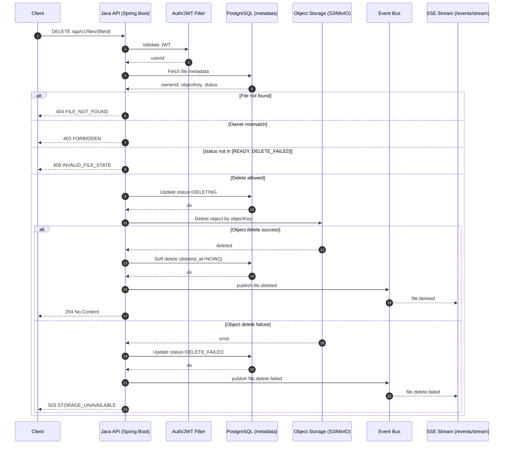

# Delete Sequence Diagram

```mermaid
sequenceDiagram
    autonumber
    participant C as Client
    participant API as Java API (Spring Boot)
    participant AUTH as Auth/JWT Filter
    participant DB as PostgreSQL (metadata)
    participant OBJ as Object Storage (S3/MinIO)
    participant EVT as Event Bus
    participant SSE as SSE Stream (/events/stream)

    C->>API: DELETE /api/v1/files/{fileId}
    API->>AUTH: Validate JWT
    AUTH-->>API: userId

    API->>DB: Fetch file metadata
    DB-->>API: ownerId, objectKey, status

    alt File not found
        API-->>C: 404 FILE_NOT_FOUND
    else Owner mismatch
        API-->>C: 403 FORBIDDEN
    else status not in [READY, DELETE_FAILED]
        API-->>C: 409 INVALID_FILE_STATE
    else Delete allowed
        API->>DB: Update status=DELETING
        DB-->>API: ok
        API->>OBJ: Delete object by objectKey
        alt Object delete success
            OBJ-->>API: deleted
            API->>DB: Soft delete (deleted_at=NOW())
            DB-->>API: ok
            API->>EVT: publish file.deleted
            EVT-->>SSE: file.deleted
            API-->>C: 204 No Content
        else Object delete failure
            OBJ-->>API: error
            API->>DB: Update status=DELETE_FAILED
            DB-->>API: ok
            API->>EVT: publish file.delete.failed
            EVT-->>SSE: file.delete.failed
            API-->>C: 503 STORAGE_UNAVAILABLE
        end
    end
```
