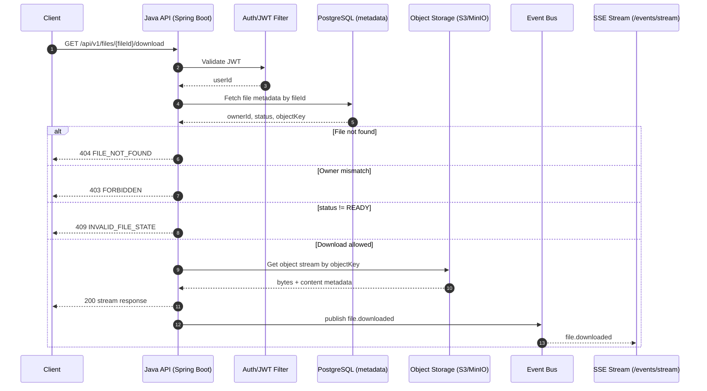

# Download Sequence Diagram

```mermaid
sequenceDiagram
    autonumber
    participant C as Client
    participant API as Java API (Spring Boot)
    participant AUTH as Auth/JWT Filter
    participant DB as PostgreSQL (metadata)
    participant OBJ as Object Storage (S3/MinIO)
    participant EVT as Event Bus
    participant SSE as SSE Stream (/events/stream)

    C->>API: GET /api/v1/files/{fileId}/download
    API->>AUTH: Validate JWT
    AUTH-->>API: userId

    API->>DB: Fetch file metadata by fileId
    DB-->>API: ownerId, status, objectKey

    alt File not found
        API-->>C: 404 FILE_NOT_FOUND
    else Owner mismatch
        API-->>C: 403 FORBIDDEN
    else status != READY
        API-->>C: 409 INVALID_FILE_STATE
    else Download allowed
        API->>OBJ: Get object stream by objectKey
        OBJ-->>API: bytes + content metadata
        API-->>C: 200 stream response
        API->>EVT: publish file.downloaded
        EVT-->>SSE: file.downloaded
    end
```
