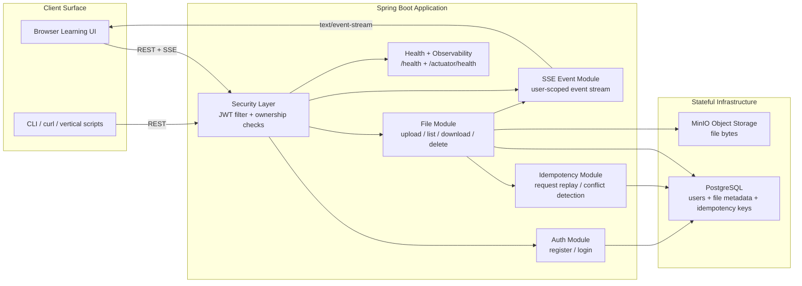

# Overall Architecture Diagram

This is the high-level view to use when explaining the system in a system design interview.

## Purpose

The application is a modular monolith built in Java with Spring Boot.
It separates:

1. authentication and authorization
2. file metadata persistence
3. blob storage
4. user-scoped real-time event delivery

That separation lets us reason clearly about consistency, ownership, and failure handling without introducing microservice complexity too early.

## Diagram

## How To Explain It

### 1. Entry points

There are two client styles:

1. browser UI for interactive learning and event observation
2. scripts or API clients for repeatable vertical tests

Both call the same Spring Boot application.

### 2. Core backend responsibilities

The application has five main responsibilities:

1. `Auth Module`
   - registers users
   - logs users in
   - issues JWTs

2. `Security Layer`
   - validates JWTs
   - resolves authenticated user identity
   - enforces ownership on file operations

3. `File Module`
   - writes metadata
   - stores and retrieves file bytes
   - coordinates state transitions such as `UPLOADING -> READY`

4. `Idempotency Module`
   - prevents duplicate creates on client retry
   - replays safe responses
   - rejects reused keys with different payloads

5. `SSE Event Module`
   - pushes file lifecycle events back to the user
   - allows the client to observe system behavior without polling

### 3. Data separation

The key architectural split is:

1. PostgreSQL stores structured metadata
   - users
   - file ownership
   - file status
   - idempotency records

2. MinIO stores binary file content
   - actual file bytes

This is one of the main system design lessons in the project:
metadata and blobs have different access patterns, scaling characteristics, and failure modes.

### 4. Main write path

For upload:

1. authenticate user
2. create metadata row as `UPLOADING`
3. write bytes to MinIO
4. update metadata to `READY`
5. publish SSE lifecycle events

That gives us a clean place to discuss consistency and partial-failure handling.

### 5. Main read path

For file listing and download:

1. list reads metadata from PostgreSQL
2. download first validates metadata and ownership
3. actual bytes are streamed from MinIO

This is a useful interview point because it shows why “list files” and “download file” are different kinds of operations.

### 6. Failure model

The design already exercises several failure cases:

1. blob write failure during upload
   - metadata becomes `FAILED`

2. blob delete failure during delete
   - metadata becomes `DELETE_FAILED`

3. duplicate client retries
   - handled through idempotency keys

4. real-time delivery interruptions
   - SSE stream is user-scoped and reconnectable from the client side

## Interview Summary

If you want the short version in an interview, say:

1. "This is a modular monolith in Spring Boot."
2. "Postgres stores users, file metadata, and idempotency records."
3. "MinIO stores the actual file bytes."
4. "JWT secures the APIs and ownership is enforced at the application layer."
5. "SSE streams file lifecycle events so clients can observe progress and outcomes in real time."
6. "The key design tradeoff is coordinating metadata and blob storage safely under failure."
