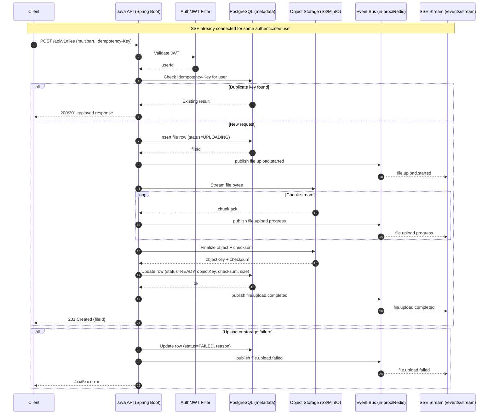

# Upload Sequence Diagram

```mermaid
sequenceDiagram
    autonumber
    participant C as Client
    participant API as Java API (Spring Boot)
    participant AUTH as Auth/JWT Filter
    participant DB as PostgreSQL (metadata)
    participant OBJ as Object Storage (S3/MinIO)
    participant EVT as Event Bus (in-proc/Redis)
    participant SSE as SSE Stream (/events/stream)

    Note over C,SSE: SSE already connected for same authenticated user

    C->>API: POST /api/v1/files (multipart, Idempotency-Key)
    API->>AUTH: Validate JWT
    AUTH-->>API: userId

    API->>DB: Check Idempotency-Key for user
    alt Duplicate key found
        DB-->>API: Existing result
        API-->>C: 200/201 replayed response
    else New request
        API->>DB: Insert file row (status=UPLOADING)
        DB-->>API: fileId
        API->>EVT: publish file.upload.started
        EVT-->>SSE: file.upload.started

        API->>OBJ: Stream file bytes
        loop Chunk stream
            OBJ-->>API: chunk ack
            API->>EVT: publish file.upload.progress
            EVT-->>SSE: file.upload.progress
        end

        API->>OBJ: Finalize object + checksum
        OBJ-->>API: objectKey + checksum
        API->>DB: Update row (status=READY, objectKey, checksum, size)
        DB-->>API: ok
        API->>EVT: publish file.upload.completed
        EVT-->>SSE: file.upload.completed
        API-->>C: 201 Created {fileId}
    end

    alt Upload or storage failure
        API->>DB: Update row (status=FAILED, reason)
        API->>EVT: publish file.upload.failed
        EVT-->>SSE: file.upload.failed
        API-->>C: 4xx/5xx error
    end
```
